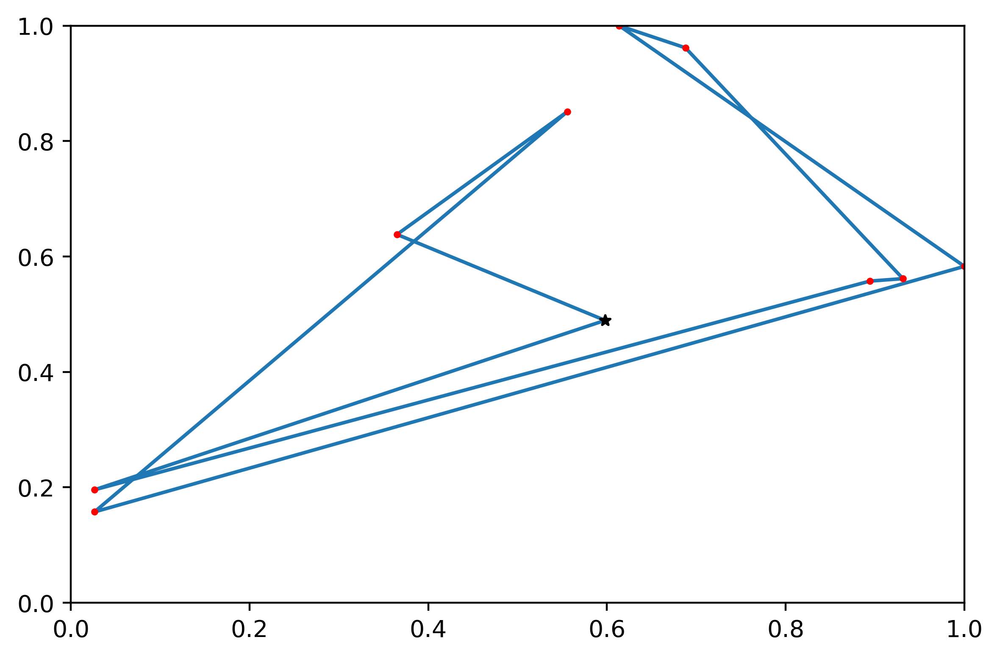
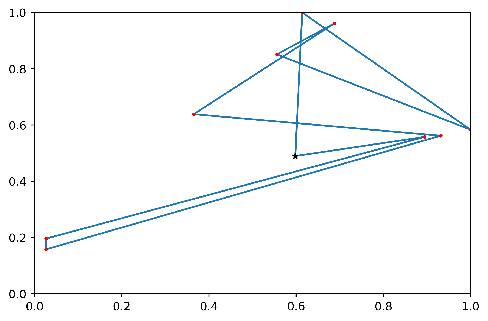
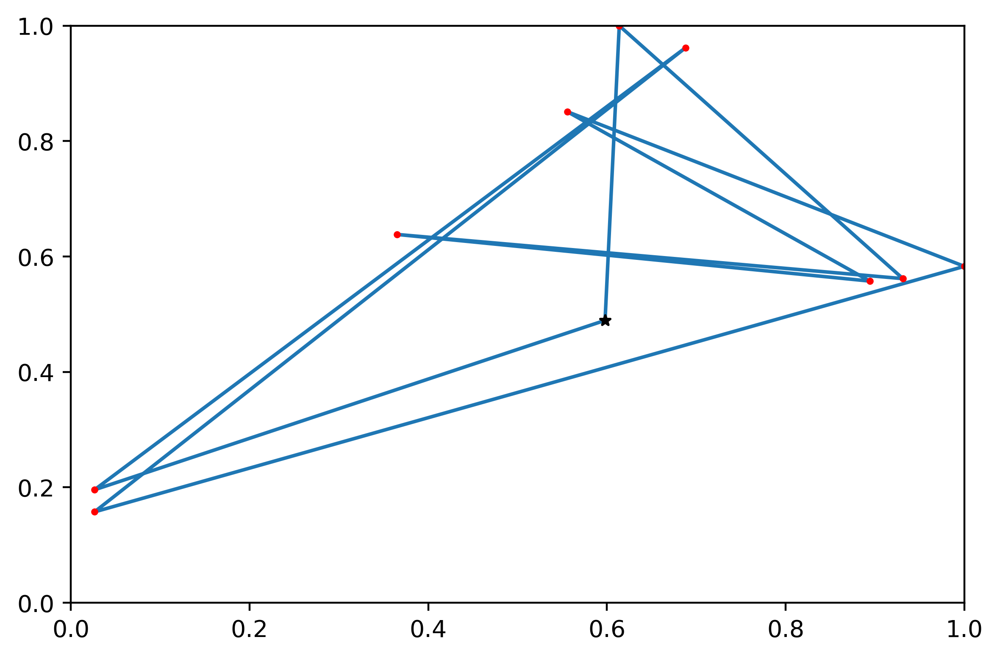

# Solving_TTP_deepRL_greedy
Solving an Traveling thisf problem with Deep Reinforcement Learning and greedy heuristics
-**Master's thesis about Reinforcement Learning (RL), Deep RL and Optimization.**
## 
- Author: Younes Sellimi
- Tutor:  HOUDA Derbel
- University: FSEGN university carthage
- Master: Master's Degree in Business computing
- Specialization: computer science
## **Result:**

## **Abstract:**
## **Contents:**
## **References:**
